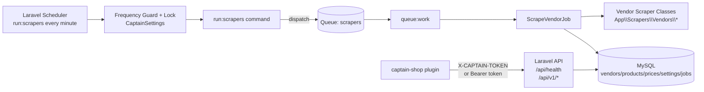

# Captain API (`captain-api`)

## Project Overview
`captain-api` is the Laravel 10 backend for the Captain Scrappin system.

It provides:
- modular vendor scrapers (one class per vendor)
- historical price snapshots for precious-metal products
- market aggregation endpoints (average, vendor breakdown, history)
- scraper orchestration endpoints (`run`, `status`)
- token-protected API consumed by `captain-shop` (WordPress/WooCommerce)

This service is the single source of truth for market data. WordPress only consumes this API and never writes directly to the Laravel database.

---

## Architecture

### High-level Flow


### Core Components
- `App\\Console\\Commands\\RunScrapers`: dispatches vendor jobs with lock and frequency guard.
- `App\\Jobs\\ScrapeVendorJob`: runs one scraper, persists immutable snapshots via `insertOrIgnore`.
- `App\\Scrapers\\Vendors\\*`: one scraper class per vendor (modular, extendable).
- `App\\Services\\CaptainSettings`: DB-backed scrape frequency and last dispatch timestamp.
- `App\\Http\\Middleware\\CaptainTokenMiddleware`: token auth via header + bearer fallback.

---

## Database Model

| Table | Purpose |
|---|---|
| `vendors` | merchants/scraper sources |
| `products` | normalized products (slug + metal) |
| `prices` | immutable historical snapshots (`vendor_id`, `product_id`, prices, stock, `scraped_at`) |
| `settings` | runtime config (`scrape_frequency_minutes`, `last_scrape_dispatch_at`) |
| `jobs` / `failed_jobs` | queue processing |

### Idempotency and History Guarantees
- Unique constraint: `prices_vendor_product_scraped_unique` (`vendor_id`, `product_id`, `scraped_at`).
- Insert strategy: `insertOrIgnore` in `ScrapeVendorJob`.
- Snapshot timestamp normalized by minute (`now()->startOfMinute()`).
- Re-running scrapers in the same minute does not create duplicates.

---

## Setup

## 1) Prerequisites
- PHP 8.2+
- Composer 2+
- MySQL/MariaDB

## 2) Install
```bash
cd /test/captain-api
composer install
cp .env.example .env
php artisan key:generate
```

## 3) Configure `.env`
Required keys (typical local values):
```dotenv
APP_URL=http://127.0.0.1:8001
DB_CONNECTION=mysql
DB_HOST=127.0.0.1
DB_PORT=3306
DB_DATABASE=captain_api
DB_USERNAME=root
DB_PASSWORD=

QUEUE_CONNECTION=database
CAPTAIN_TOKEN=your-secure-token
CAPTAIN_TOKEN_HEADER=X-CAPTAIN-TOKEN
SCRAPE_INTERVAL=5
SCRAPE_QUEUE_CONNECTION=database
SCRAPE_QUEUE_NAME=scrapers
```

## 4) Migrate + Seed
```bash
php artisan migrate --seed --force
php artisan optimize:clear
```

Fresh reset:
```bash
php artisan migrate:fresh --seed --force
```

---

## Run the Service

Run in separate terminals:

### Terminal A: API server
```bash
php artisan serve --host=127.0.0.1 --port=8001
```

### Terminal B: Queue worker
```bash
php artisan queue:work --queue=scrapers --tries=5
```

### Terminal C: Scheduler
```bash
php artisan schedule:work
```

Optional one-shot scheduler tick:
```bash
php artisan schedule:run
```

---

## Scraper Operations

## CLI
Run with frequency guard:
```bash
php artisan run:scrapers
```

Force immediate dispatch:
```bash
php artisan run:scrapers --force
```

Run synchronously (no queue):
```bash
php artisan run:scrapers --sync --force
```

Run one vendor only:
```bash
php artisan run:scrapers --vendor=aurum-market --force
```

## API
Trigger dispatch:
```bash
curl -X POST "http://127.0.0.1:8001/api/v1/scrapers/run" \
  -H "X-CAPTAIN-TOKEN: your-secure-token" \
  -H "Content-Type: application/json" \
  -d '{"force":true}'
```

Check scraper status:
```bash
curl "http://127.0.0.1:8001/api/v1/scrapers/status" \
  -H "X-CAPTAIN-TOKEN: your-secure-token"
```

Expected status fields:
- `queue.pending_jobs`
- `queue.failed_jobs`
- `last_dispatch_at`
- `latest_scraped_at`
- `latest_prices[]`
- `recent_logs[]`

## From WordPress Admin
In `Captain Sync` admin page (`captain-shop`):
- **Run Laravel Scrapers** button calls `POST /api/v1/scrapers/run` through WP AJAX.

---

## API Authentication
All custom integration routes require token auth.

Accepted formats:
1. Header token:
```http
X-CAPTAIN-TOKEN: your-secure-token
```
2. Bearer fallback:
```http
Authorization: Bearer your-secure-token
```

Auth behavior:
- missing token -> `401`
- invalid token -> `401`
- valid token -> `200`

Health route is also protected:
- `GET /api/health`
- `GET /api/v1/health`

---

## API Routes

| Method | Path | Description |
|---|---|---|
| GET | `/api/health` | health alias |
| GET | `/api/v1/health` | health metrics |
| GET | `/api/v1/openapi` | OpenAPI YAML |
| GET | `/api/v1/products` | products list |
| GET | `/api/v1/products/latest` | latest aggregated snapshot per product |
| GET | `/api/v1/products/{slug}/average` | average (latest per vendor) |
| GET | `/api/v1/products/{slug}/vendors` | latest vendor rows |
| GET | `/api/v1/products/{slug}/history` | historical avg time series |
| GET | `/api/v1/config` | scrape config |
| PUT | `/api/v1/config/scrape-frequency` | update frequency in minutes |
| POST | `/api/v1/scrapers/run` | trigger scraper dispatch |
| GET | `/api/v1/scrapers/status` | queue + scraper status |

OpenAPI file location:
- `docs/openapi.yaml`

---

## Data Seeding Verification

Check baseline data:
```bash
php artisan tinker --execute "echo DB::table('products')->count();"
php artisan tinker --execute "echo DB::table('vendors')->count();"
php artisan tinker --execute "echo DB::table('prices')->count();"
```

Expected after fresh seed:
- products: `5`
- vendors: `3`
- prices: `180` (before additional scraper runs)

Check vendor coverage and stock status:
```bash
curl "http://127.0.0.1:8001/api/v1/products/silver-ounce/vendors" \
  -H "X-CAPTAIN-TOKEN: your-secure-token"
```

Expected: multiple vendors with `stock_status` values (`in_stock`, `out_of_stock`, `unknown`).

---

## Manual Test Commands (Quick Runbook)

## 1) Auth checks
```bash
curl -o /dev/null -w "%{http_code}" http://127.0.0.1:8001/api/v1/products/gold-bar-1kg/average
curl -o /dev/null -w "%{http_code}" -H "X-CAPTAIN-TOKEN: wrong" http://127.0.0.1:8001/api/v1/products/gold-bar-1kg/average
```
Expected: `401` / `401`

## 2) Valid average + history
```bash
curl "http://127.0.0.1:8001/api/v1/products/gold-bar-1kg/average" \
  -H "X-CAPTAIN-TOKEN: your-secure-token"

curl "http://127.0.0.1:8001/api/v1/products/gold-bar-1kg/history" \
  -H "X-CAPTAIN-TOKEN: your-secure-token"
```
Expected: `success=true`, non-empty `data`.

## 3) Dispatch + process queue
```bash
curl -X POST "http://127.0.0.1:8001/api/v1/scrapers/run" \
  -H "X-CAPTAIN-TOKEN: your-secure-token" \
  -H "Content-Type: application/json" \
  -d '{"force":true}'

php artisan queue:work --queue=scrapers --stop-when-empty
```
Expected: job execution logs and `pending_jobs=0` afterwards.

## 4) Idempotency check
```bash
php artisan tinker --execute "echo DB::table('prices')->count();"
php artisan run:scrapers --sync --force
php artisan tinker --execute "echo DB::table('prices')->count();"
```
Expected: no count increase if executed in the same minute.

---

## Queue and Scheduler Management

## Dev
- `php artisan queue:work --queue=scrapers`
- `php artisan schedule:work`

## Production recommendation
Use a process manager for workers and scheduler (Supervisor/systemd) so jobs continue after restarts.

Minimum health checks:
- `GET /api/health`
- `php artisan queue:failed`
- `GET /api/v1/scrapers/status`

---

## Troubleshooting

## 1) `401 Unauthorized`
- Verify `CAPTAIN_TOKEN` in `captain-api/.env`.
- Verify client sends `X-CAPTAIN-TOKEN` (or bearer token).
- Clear config cache:
```bash
php artisan optimize:clear
```

## 2) Scrapers dispatched but no new data
- Queue worker not running.
- Start worker:
```bash
php artisan queue:work --queue=scrapers
```

## 3) Frequency updates not reflected
- `GET /api/v1/config` can be cached briefly.
- Retry after cache TTL or run `php artisan optimize:clear`.

## 4) `pending_jobs` keeps increasing
- Worker down or wrong queue name.
- Ensure worker runs `--queue=scrapers`.

## 5) No history points
- Ensure `prices.scraped_at` is populated (seeders/scrapers do this).
- Verify product slug exists via `/api/v1/products`.

## 6) OpenAPI inaccessible
- `/api/v1/openapi` is token-protected by design.

---

## Integration with `captain-shop`
`captain-shop` should use only API calls with token auth.

Main WordPress-consumed endpoints:
- `/api/v1/products/{slug}/average`
- `/api/v1/products/{slug}/history`
- `/api/v1/scrapers/run`
- `/api/v1/scrapers/status`
- `/api/health`

For full frontend/shop runbook, see:
- `/test/captain-shop/test/README.md`
